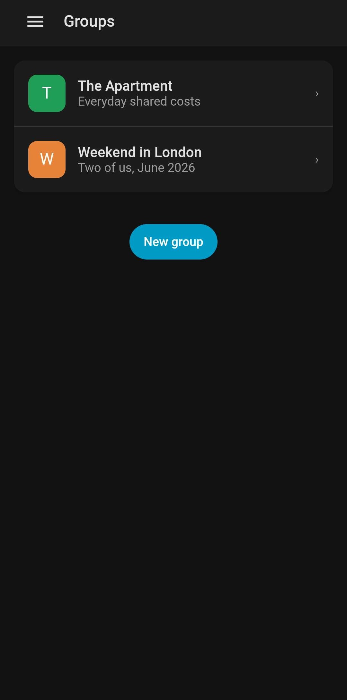
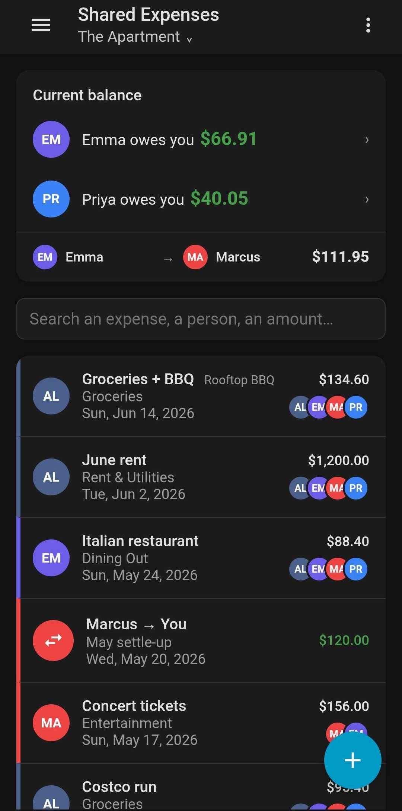
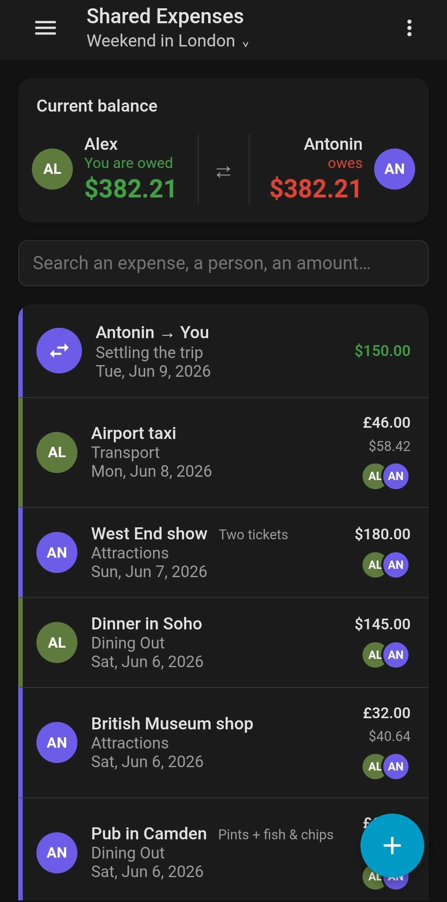
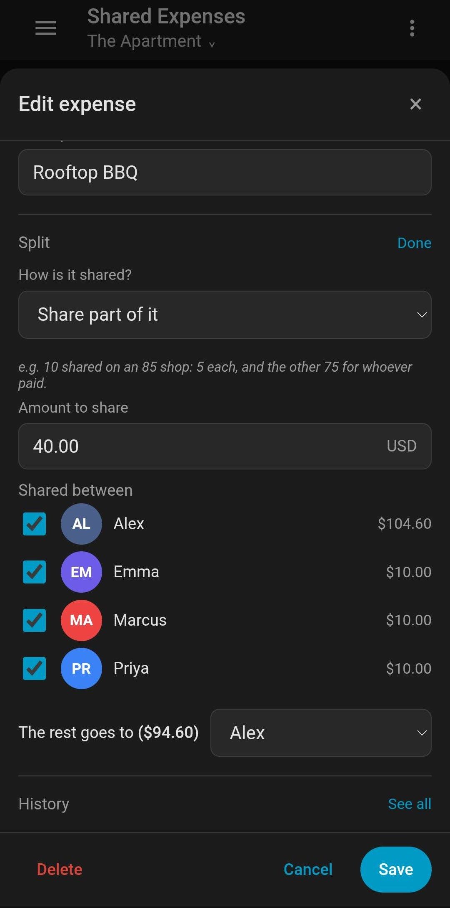
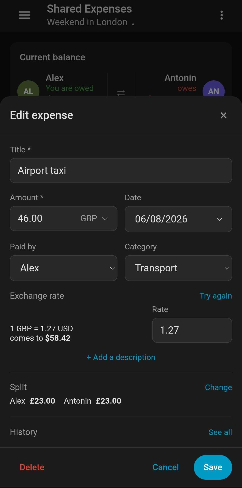
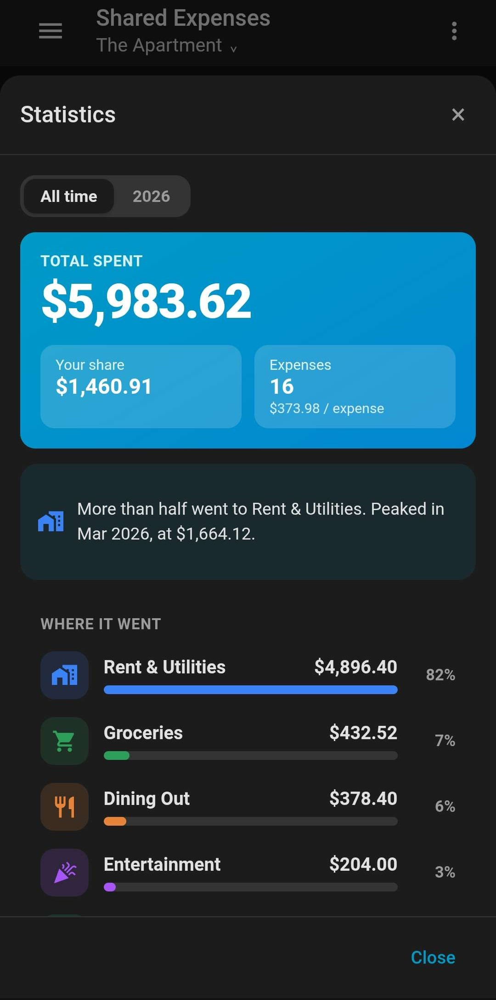
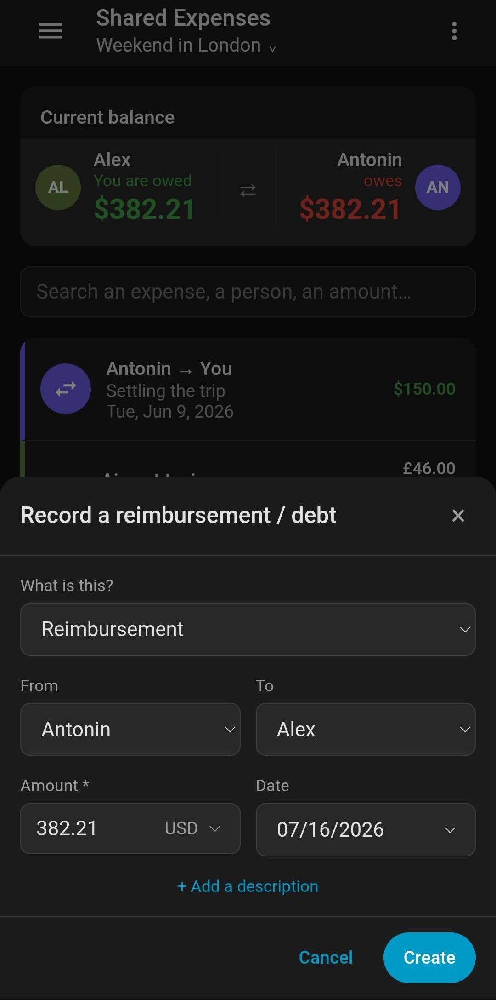

# Shared Expenses

Shared expenses for Home Assistant: who paid, who owes what, and who reimburses
whom. No account to create and nothing to sync — the data lives in your own
instance, next to the rest of it.

Everyone in the house logs in as themselves. Each person sees the groups they
belong to, and nothing else.

## Screenshots

<table>
  <tr>
    <td align="center" width="33%"><br><sub>Your groups, one tap in</sub></td>
    <td align="center" width="33%"><br><sub>Who owes what, from where you stand</sub></td>
    <td align="center" width="33%"><br><sub>Two of you, in a currency the group doesn't count in</sub></td>
  </tr>
  <tr>
    <td align="center"><br><sub>Share part of it, the rest to whoever paid</sub></td>
    <td align="center"><br><sub>The rate, frozen the day it was owed</sub></td>
    <td align="center"><br><sub>Where the money went</sub></td>
  </tr>
  <tr>
    <td align="center"><br><sub>Record money paid back</sub></td>
    <td></td>
    <td></td>
  </tr>
</table>

## Features

- **Groups** — a flat, a holiday, a couple. Home Assistant accounts or people
  without one; one currency chosen once, a name you can change anytime.
- **Who may do what** — four switches (members, categories, the group, others'
  expenses), the same for everyone, with one admin above them who can hand it on.
- **Expenses** — a title, an amount, who paid, a date, a category, and a split.
- **Split rules** — equally, by fixed amounts or percentages, or an envelope
  shared between some with the rest to whoever paid; categories carry their own.
- **Other currencies** — pay in another currency; the day's rate is fetched and
  frozen onto what it converted, so a debt stays what it was the day it was owed.
- **Balances** — who owes what, and the shortest set of transfers that clears it.
- **Reimbursements and debts** — record money moved, or merely owed; someone who
  left the group can still be paid back.
- **One list** — expenses and reimbursements together, newest first, searchable
  by anything on the row: a shop, a person, a category, an amount.
- **Written from where you stand** — "you are owed", green when the money comes
  your way, red when it leaves.
- **Statistics** — what the group spent, by category and by month, and what of it
  was yours.
- **History** — every change, who made it, and what moved; deletions included,
  and a deleted expense can be brought back from there as the one it was.
- **On the dashboard** — a card that tells each viewer what *they* owe, plus
  optional per-group sensors and `add_expense` / `settle_up` actions.
- **Mobile first** — a single panel, thumb-reachable, in your own theme, light or
  dark.

Amounts are held in cents, as integers: no rounding drift, ever. Rates are held
in millionths, and are integers too.

## Installation

### HACS

1. In HACS, add `https://github.com/Kami-fr/shared_expenses` as a custom
   repository of type *Integration*.
2. Install **Shared Expenses**.
3. Restart Home Assistant.
4. Go to **Settings → Devices & services → Add integration**, and pick
   **Shared Expenses**.

### Manually

Copy `custom_components/shared_expenses` into your `config/custom_components`
directory and restart Home Assistant, then add the integration as above.

There is nothing to configure and no YAML to write. **Shared Expenses** appears
in the sidebar once the integration is added.

## How the split works

Every expense resolves to a set of shares, and it is the shares that are stored
— the balances only ever read those. A rule is kept alongside them so reopening
an expense shows what was meant, not just the figures it happened to produce.

A rule has two parts:

- **An envelope**, shared equally between the people you tick. Leave it empty and
  the whole expense is shared.
- **The rest**, which goes to whoever paid unless you say otherwise, or is split
  between the people you tick — equally, by exact amounts, or by percentages.

An 85,42 € shop where only 5 € of it is shared, for instance: an envelope of 5 €
between the two of you, the rest to whoever paid.

Rules are stored with their members spelled out, never as "everyone". Someone
joining next month never falls into an expense they had nothing to do with, and
an old expense always resolves back to the same shares.

A split is settled in what the expense was paid in — the editor sits under the
amount, so "Antonin owes 20" on a New York dinner is twenty dollars. The shares
are then converted and stored in the group's currency, which is what balances can
be counted in. The converted total is divided rather than each share converted on
its own: three shares of a cent at a rate of a third would each round to nothing,
and the shares would stop adding up to what they are shares of.

## On the dashboard

Add a card, pick **Shared Expenses**, and the balances are on your dashboard —
the same ones as in the panel, drawn by the same code:

```yaml
type: custom:shared-expenses-card
group_id: 01KXHEB4VFFWMAN5CG4BDNNBF9
```

**It speaks to whoever is looking.** A card runs in your browser, on your own
connection, so you read what *you* owe and your flatmate reads what *they* owe.
Nothing here is an entity, so nobody outside the group can read it. Add or edit
the card from the dashboard's own UI and a group picker fills the id in for you.

A group can also put its **figures** on the dashboard as entities — off by
default, since Home Assistant lets every account in the house read any entity.
Turn it on under **Edit group → Dashboard sensors**:

| Entity | What it says |
|--------|--------------|
| Total spent | What the group has spent since it started — expenses only |
| One per member | Their balance: positive is owed to them, negative is owed by them |
| Last activity | When something was last entered |

With those entities come two actions, `add_expense` and `settle_up`, so a tile,
an NFC tag, or an automation can add the shopping or settle the rent:

```yaml
type: tile
entity: sensor.the_apartment_total_spent
name: Bread
icon: mdi:baguette
tap_action:
  action: perform-action
  perform_action: shared_expenses.add_expense
  data:
    group_id: 01KXHEB4VFFWMAN5CG4BDNNBF9
    title: Bread
    amount: 1.30
    paid_by_member_id: 01KXHEB4VG7Q2M8XQZ0P3R5T7V
```

**More recipes** — a reimbursement tile, a monthly gauge, calling from an
automation, and where the ids come from — are in
**[docs/dashboard.md](docs/dashboard.md)**.

## Requirements

- Home Assistant **2026.7.0** or later
- No account, no API key

One request ever leaves your instance, and only if you ask for it: an expense or a
reimbursement in a currency the group does not count in fetches that day's rate
from [Frankfurter](https://frankfurter.dev), a free open-source service sourcing
from central banks and needing no key. Nothing about the expense is sent — only
the pair of currencies and the date.

The rate is always yours to overwrite, and typing one always wins. The service
being down, or the instance being offline, never stands between you and writing
down what you just spent.

## Development

```bash
python -m venv .venv
.venv/Scripts/activate        # source .venv/bin/activate on Linux and macOS
pip install -e ".[dev]"

pytest                        # the manager, against a real SQLite database
ruff check .

cd frontend
npm install
npm run build                 # writes custom_components/shared_expenses/www
```

The panel is Lit 3 and TypeScript, built by Vite. It talks to the integration
over the Home Assistant WebSocket API and never through entities: the panel knows
who is asking, and every rule in here depends on that.

The dashboard card is the same bundle and the same conversation — it runs in a
browser too, so it asks over the WebSocket API and is answered as whoever is
looking. It has to be one bundle: Home Assistant is a single page, and two would
each define `se-balance-card`, the second throwing and taking the panel with it.
See ADR-015.

The entities go the other way and are a separate surface. They belong to the
instance rather than to an account, which is why a group has to ask for them —
see ADR-014.

A group is a `group` on screen as well as in the code: the tables, the commands,
the URL and the translation keys all keep the word, and the panel no longer
stands apart from them.

Some logic exists twice, in Python for the backend and in TypeScript so the panel
can show what an expense comes to before you save it — the split resolver, and
the conversion of money at a rate. Each pair is checked against the other on
generated cases, and each harness has a test that sabotages one side to prove it
can still fail. The panel must never promise a figure the backend would not store.

`docs/adrs` records the decisions and why they were taken; `docs/dashboard.md`
covers everything on the dashboard, and `docs/database.md` the schema and its
migrations.

## Bugs and ideas

Both go to [the issue tracker](https://github.com/Kami-fr/shared_expenses/issues).
A bug about money is worth the figures it happened on: what the expense was, the
rule, and what you expected instead.

## Licence

MIT
